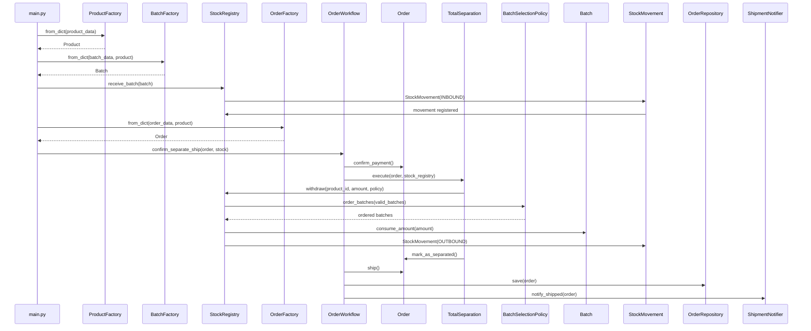

# Fluxo das Classes e Comportamentos

## Objetivo

Este documento descreve como as classes se comunicam no fluxo principal do sistema da Distribuidora de Bebidas, desde a carga de dados mockados até a expedição do pedido.

O objetivo da comunicação entre classes é impedir que `main.py` concentre regras de negócio. `main.py` monta o cenário; os objetos de domínio decidem se uma operação é válida.

---

## Fluxo principal

```text
main.py
  ↓ lê dummy_data.json
ProductFactory
  ↓ cria Product
BatchFactory
  ↓ cria Batch
StockRegistry.receive_batch(batch)
  ↓ registra entrada
StockMovement(INBOUND)
  ↓ atualiza Product.add_stock(...)
OrderFactory
  ↓ cria Order com OrderItem
OrderWorkflow.confirm_separate_ship(...)
  ↓ Order.confirm_payment()
  ↓ TotalSeparation.execute(...)
      ↓ StockRegistry.withdraw(...)
          ↓ BatchSelectionPolicy.order_batches(...)
          ↓ Batch.consume_amount(...)
          ↓ StockMovement(OUTBOUND)
          ↓ Product.remove_stock(...)
      ↓ OrderItem.mark_separated(...)
      ↓ Order.mark_as_separated()
  ↓ Order.ship()
      ↓ tracking_code
      ↓ shipped_at
      ↓ status EM TRANSPORTE
  ↓ OrderRepository.save(order)
  ↓ ShipmentNotifier.notify_shipped(order)
orders.json
```

---

## Diagrama de sequência



---

## Comunicação por responsabilidade

### Criação de objetos

`ProductFactory`, `BatchFactory` e `OrderFactory` recebem dicionários vindos do JSON e constroem objetos válidos.

Decisão: `main.py` não deve conhecer detalhes de todos os construtores.

### Recebimento de estoque

`StockRegistry.receive_batch(batch)` recebe um `Batch`, guarda o lote e cria uma movimentação de entrada.

Colaboração:

```text
StockRegistry → StockMovement → Product.add_stock(...)
```

Regra protegida: toda entrada precisa gerar histórico.

### Separação de pedido

`TotalSeparation.execute(...)` coordena a separação. Ele não altera o pedido sozinho e também não consome lote diretamente quando existe `StockRegistry`.

Colaboração:

```text
TotalSeparation → StockRegistry.withdraw(...) → Batch.consume_amount(...)
TotalSeparation → OrderItem.mark_separated(...)
TotalSeparation → Order.mark_as_separated()
```

Regra protegida: o pedido só fica separado depois da baixa e da marcação de todos os itens.

### Seleção de lote

`BatchSelectionPolicy` define a ordem dos lotes.

Implementações atuais:

- `FefoBatchSelectionPolicy`: usa primeiro o lote que vence antes;
- `LifoBatchSelectionPolicy`: prova que a política pode variar sem mudar `StockRegistry` ou `TotalSeparation`.

Decisão: FEFO é a regra padrão do negócio, mas foi isolada para permitir evolução.

### Expedição

`Order.ship()` executa a expedição.

Colaboração:

```text
Order.ship() → generate tracking_code → set shipped_at → update_status("EM TRANSPORTE")
```

Regra protegida: expedição só acontece se o pedido estiver separado e ainda não expedido.

### Persistência simulada

`JsonOrderRepository` salva snapshots em `orders.json`.

Colaboração:

```text
OrderWorkflow → OrderRepository.save(order) → JsonOrderRepository → json_storage.write_json(...)
```

Regra protegida: JSON é detalhe de infraestrutura simulada, não dono do domínio.

---

## Fluxo alternativo: falha de separação

```text
Order está EM PROCESSAMENTO
  ↓
TotalSeparation.execute(...)
  ↓
StockRegistry.withdraw(...)
  ↓
Saldo válido insuficiente
  ↓
ValueError
  ↓
Nenhum pedido é expedido
  ↓
Nenhum snapshot de pedido expedido deve ser salvo
```

Regra: a validação de disponibilidade ocorre antes de completar a separação, evitando pedido parcialmente separado.

---

## Fluxo alternativo: expedição inválida

```text
Order não está SEPARADO
  ↓
Order.ship()
  ↓
ValueError("Pedido só pode ser expedido após separação total")
```

Regra: `OrderWorkflow` deve chamar `TotalSeparation` antes de `Order.ship()`. Mesmo que alguém tente expedir diretamente, o agregado `Order` bloqueia.

---

## Limite entre domínio e infraestrutura

```text
Domínio:
Product, Batch, StockRegistry, Order, OrderItem, TotalSeparation, Policies

Aplicação/orquestração simples:
OrderWorkflow, main.py

Infraestrutura simulada:
json_storage.py, JsonOrderRepository, orders.json, dummy_data.json
```

A fronteira principal é o protocolo `OrderRepository`, que permite usar `JsonOrderRepository` no demo e `InMemoryOrderRepository` nos testes.
